# Lend

**Lend** is a Flutter app (Android & iOS) that enables users to list assets for rent and let other users book them for chosen date ranges. Owners can post multiple images, pin the item location on Google Maps, set price per day, and manage availability. Renters can browse listings (publicly visible), propose booking date ranges, negotiate via an in-app chat, and confirm bookings. The first user to pay (outside the app, via chat agreement) secures the dates — there is no third‑party payment gateway integrated yet.

## Screenshots

<div style="display: flex; justify-content: start; gap: 10px;">
  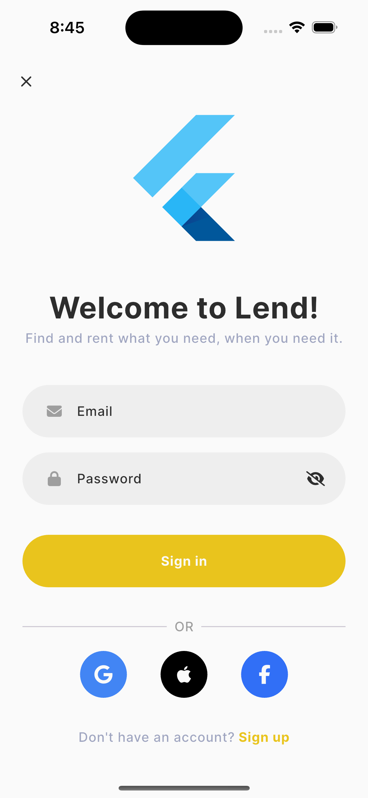
  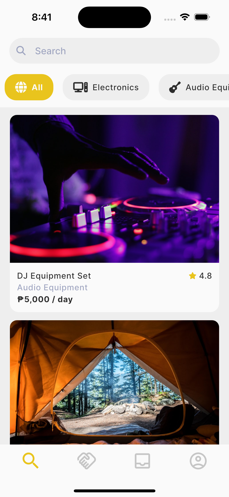
  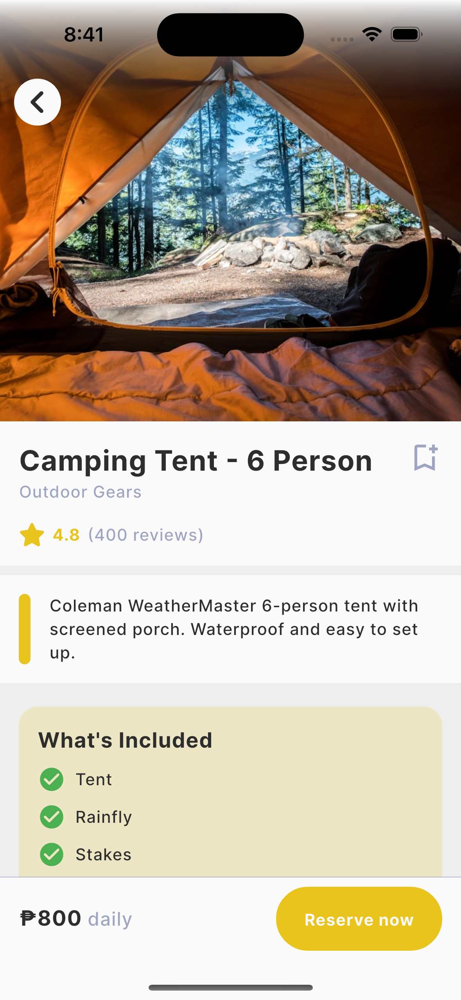
</div>
<br>
<div style="display: flex; justify-content: start; gap: 10px;">
  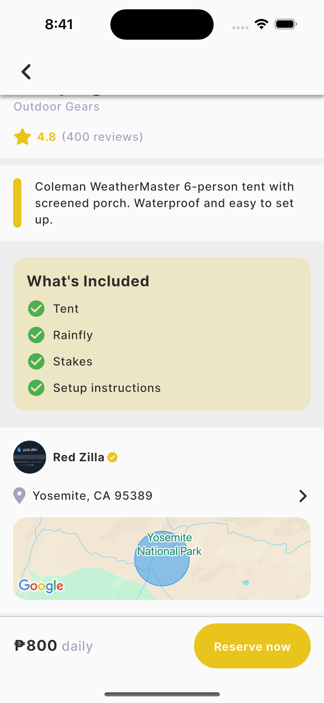
  
  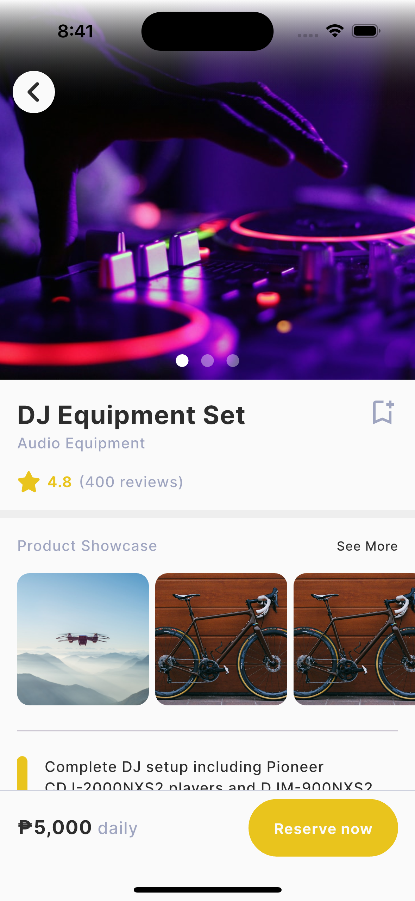
</div>
<br>
<div style="display: flex; justify-content: start; gap: 10px;">
  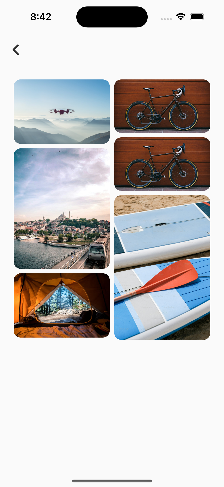
  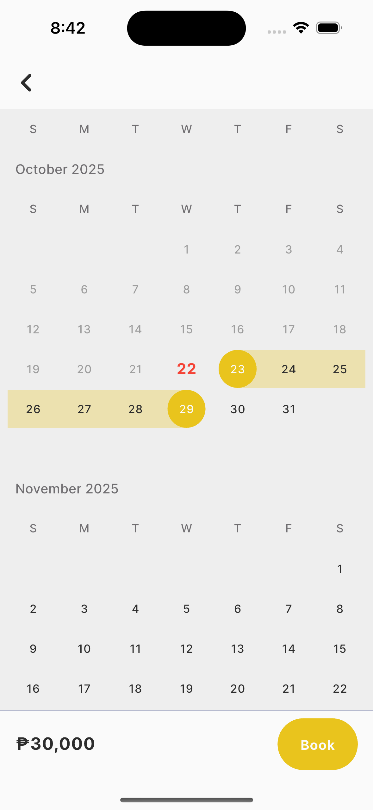
  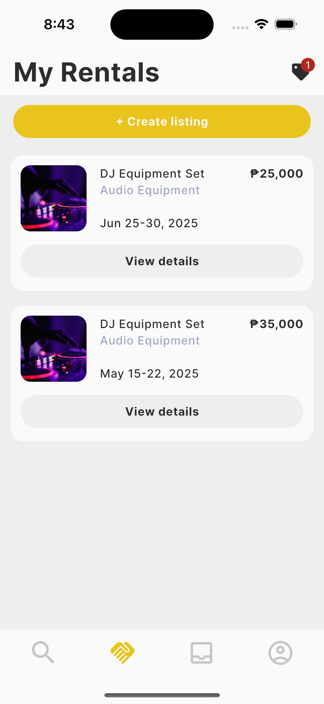
</div>
<br>
<div style="display: flex; justify-content: start; gap: 10px;">
  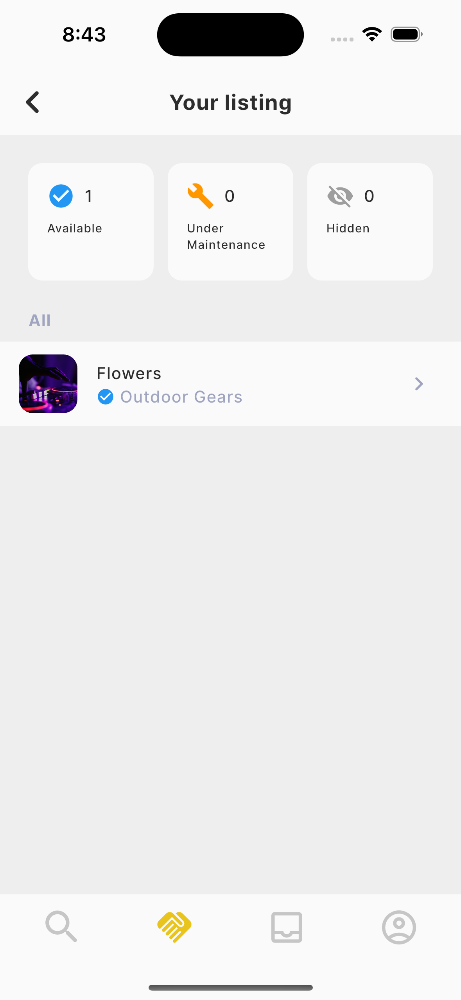
  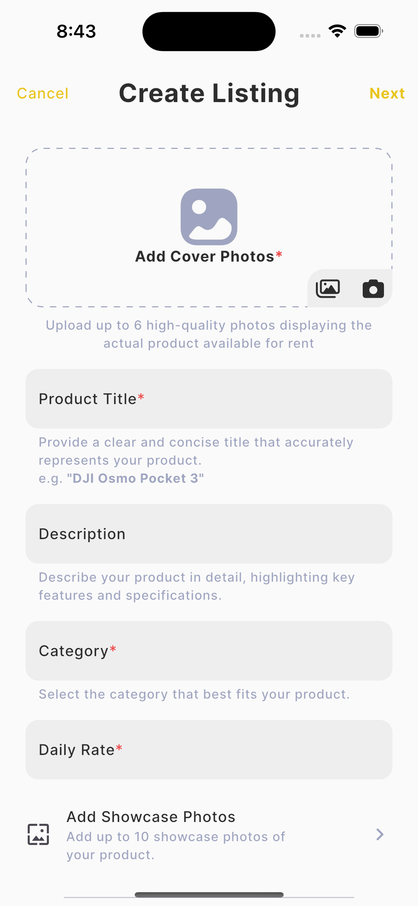
  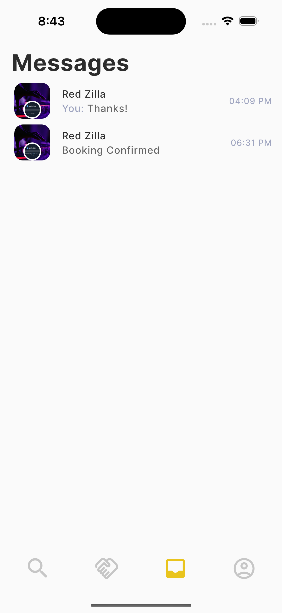
</div>
<br>
<div style="display: flex; justify-content: start; gap: 10px;">
  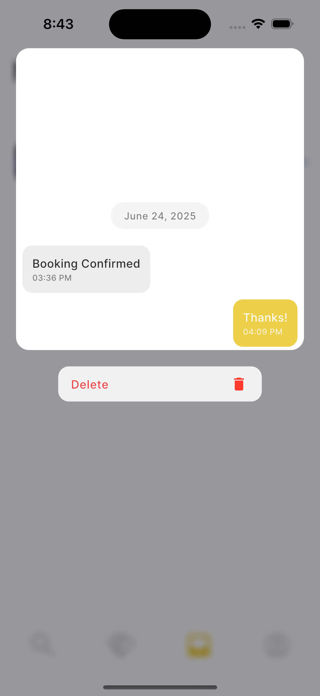
  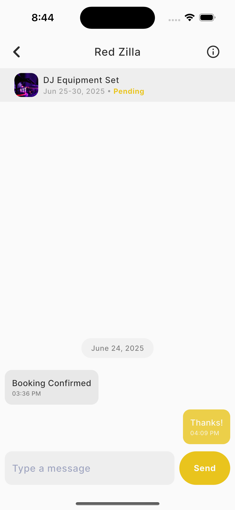
  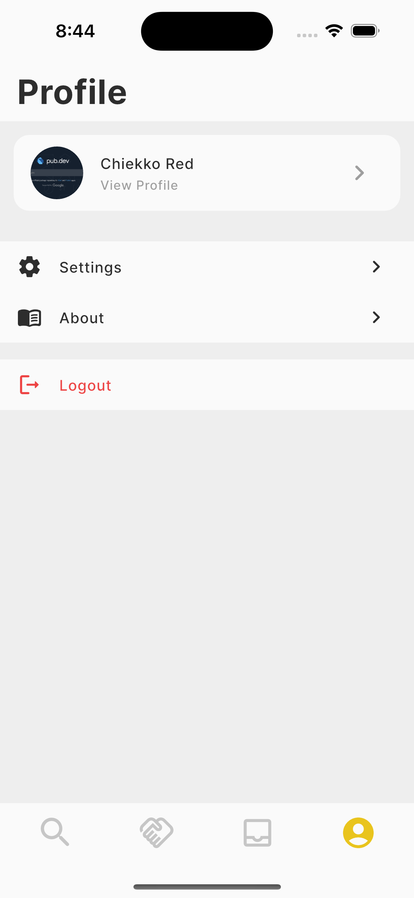
</div>
<br>
<div style="display: flex; justify-content: start; gap: 10px;">
  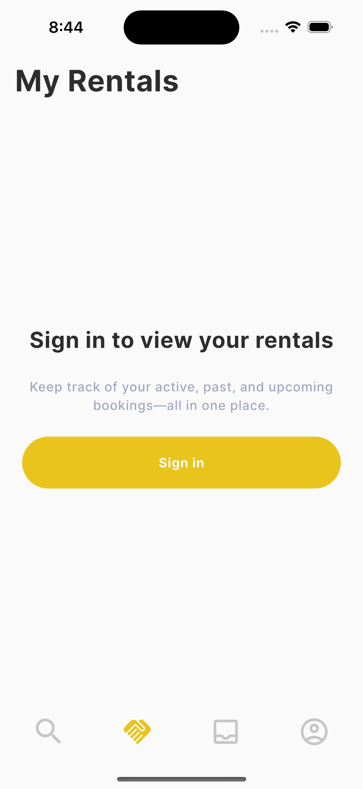
  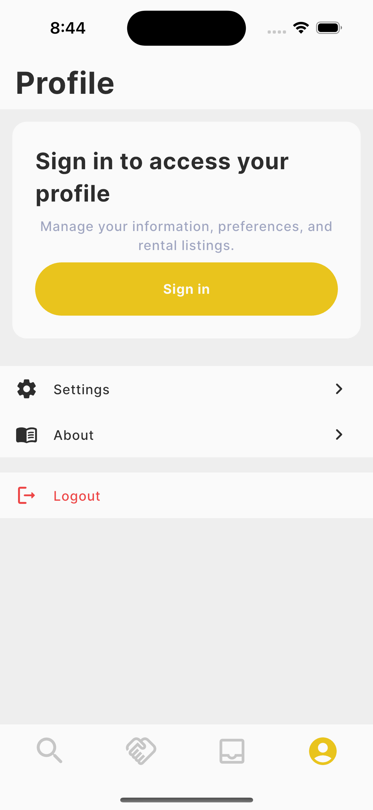
</div>

---

## Table of contents

- [Key Features](#key-features)
- [Tech Stack & Packages](#tech-stack--packages)
- [Folder Structure](#folder-structure)
- [Authentication & Roles](#authentication--roles)
- [FVM (Flutter Version Management)](#fvm-flutter-version-management)
- [Installation](#installation)
- [Running the App](#running-the-app)
- [Testing](#testing)
- [Security & Rules](#security--rules)
- [Troubleshooting](#troubleshooting)
- [Contributing](#contributing)
- [License](#license)

---

## Key Features

- Post assets for rent (multiple images, title, category, description, inclusions, pinned map location, price per day).
- Public Explore feed (visible to non-authenticated users; booking and messages require login).
- Date-range booking UI (calendar picker) for prospective renters.
- Ownership verification workflow (users can be promoted to owner/poster role after validation).
- In-app messages created when a booking is proposed so owner & renter can negotiate price and confirm.
- Booking confirmation reserves dates on a first-pay basis (payments currently handled outside the app via chat agreement).
- Save listings as favorites, search via Algolia, and post reviews after completed bookings.

---

## Tech Stack & Packages

- Flutter (managed via **FVM**)
- State management: **GetX**
- Local caching: **Get Storage**
- Auth: **Firebase Auth** (Google Sign-In, Apple Sign-In, Facebook Sign-In)
- Realtime DB: **Firebase Firestore**
- Media hosting: **Firebase Storage**
- Maps: **Google Maps SDK** for Android & iOS
- Search: **Algolia** (for fast full-text & geo-aware search)

---

## Folder Structure

Use the structure you provided. Copy for quick reference:

```
lib/
├── core
    ├──models/          # Data models for the application
    ├──bindings/        # Controller bindings for the application
    ├──mixins/          # Reusable methods for classes
    ├──services/        # API services and networking
    └──middlewares/     # For Middleware/Bridge Connection
├── presentations/      # Controller and UI views
    ├──common/          # Common reusable UI widgets
    ├──controllers/     # Business logic controllers (using Getx)
    └──pages/           # App pages for UI
        ├──components/  # Sub pages of the main page
        └──widgets/     # Small widgets of the main page
├── utilities/          # Utility functions, constants, helpers
    ├──constants/       # App constant values
    ├──data/            # Mockup data objects
    ├──enums/           # Enum objects
    ├──extensions/      # Data type return extensions
    └──helpers/         # Reusable logic helper method/functions
└── main.dart
```

---

## Authentication & Roles

- Provided sign-in options: Google, Apple (iOS), Facebook, and email/phone if desired.
- After sign-up, users are default **renters**.
- Role-based rules are applied at Firestore Security Rules.

---

## FVM (Flutter Version Management)

Use FVM to lock the Flutter SDK per project. Include `.fvm/fvm_config.json` in repo if you want teammates to use the same version.

Common commands:

```bash
# install fvm
dart pub global activate fvm

# install the project SDK
fvm install

# fetch deps
fvm flutter pub get

# run
fvm flutter run
```

---

## Installation

1. Clone repository

```bash
git clone <repo-url>
cd lend
```

2. Install FVM & SDK

```bash
dart pub global activate fvm
fvm install
fvm use <version>
```

3. Install dependencies

```bash
fvm flutter pub get
```

4. Firebase & Google Maps setup

- Create Firebase project, enable Auth, Firestore, Storage.
- Register iOS & Android apps and add `GoogleService-Info.plist` / `google-services.json`.
- Add Google Maps API keys in native configs (AndroidManifest, AppDelegate/Info.plist) and restrict keys in Google Cloud Console.

---

## Running the App

**Recommended**: Run using `Debug and Run` via **VSCode**. All available builds are listed already.

or use your preferred **CLI**:

- Android emulator: `fvm flutter run -d emulator-5554`
- iOS simulator: `fvm flutter run -d <ios-sim>`
- Release builds:

  - Android: `fvm flutter build apk --release`
  - iOS: `fvm flutter build ipa --release`

---

## Testing

- Unit tests: `fvm flutter test`
- Integration tests: `integration_test/` + `fvm flutter drive --target=integration_test/app_test.dart`

---

## Security & Rules

- Firestore security rules must prevent unauthorized creation/modification of `assets`, `bookings`, and `chats`.

- Only the owner and renter should be able to read/write messages in a chat.

- Validate date ranges and prevent overlapping `confirmed` bookings at the rules or backend level.
- Use Firebase App Check to reduce unauthorized API calls from fake clients.

---

## Troubleshooting

- **Images not uploading**: check Storage rules & CORS config (if using REST uploads). Verify the upload path and file size.
- **Map not showing**: verify API keys, billing enabled in Google Cloud, and the package setup for both platforms.
- **Auth providers failing**: confirm OAuth client IDs, redirect URIs, and that the bundle/package names match your Firebase app.

---

## To do

❌ Search feature using Algolia

❌ Confirm booking to reserve dates

❌ Save listing as Favorites

❌ Review feature

---

## License

Lend is MIT licensed. See `LICENSE`.

---
